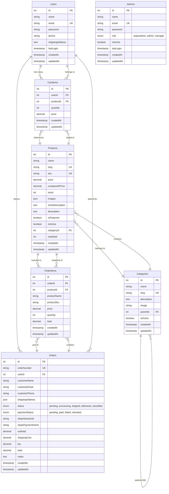

# Database Schema - ER Diagram



## Table Descriptions

### Users
Customer accounts with authentication and shipping information.
- **Primary Key:** id
- **Unique Constraints:** email
- **Indexes:** email
- **Features:** bcrypt password hashing, JSON shipping address

### Admins
Administrator accounts with role-based access control.
- **Primary Key:** id
- **Unique Constraints:** email
- **Indexes:** email
- **Roles:** superadmin (full access), admin (management), manager (limited)

### Categories
Hierarchical product categorization system.
- **Primary Key:** id
- **Unique Constraints:** slug
- **Indexes:** slug, parentId
- **Features:** Self-referential for parent-child relationships, auto-generated slugs

### Products
Complete product information with inventory tracking.
- **Primary Key:** id
- **Unique Constraints:** slug, sku
- **Foreign Keys:** categoryId → Categories(id)
- **Indexes:** slug, sku, categoryId, isFeatured
- **Features:** JSON image array, featured products, stock tracking, sales counter

### CartItems
Shopping cart line items for authenticated users.
- **Primary Key:** id
- **Foreign Keys:** 
  - userId → Users(id) ON DELETE CASCADE
  - productId → Products(id) ON DELETE CASCADE
- **Indexes:** userId, productId
- **Unique Together:** userId + productId
- **Features:** Price snapshot at time of adding

### Orders
Customer orders with payment and shipping tracking.
- **Primary Key:** id
- **Unique Constraints:** orderNumber
- **Foreign Keys:** userId → Users(id) ON DELETE SET NULL
- **Indexes:** orderNumber, userId, status, paymentStatus, stripeSessionId
- **Features:** Stripe integration, automatic order number generation, JSON shipping address

### OrderItems
Order line items with product snapshot data.
- **Primary Key:** id
- **Foreign Keys:**
  - orderId → Orders(id) ON DELETE CASCADE
  - productId → Products(id) ON DELETE SET NULL
- **Indexes:** orderId, productId
- **Features:** Product data snapshot to preserve order history

## Relationships

1. **Users → CartItems** (1:N)
   - One user can have many cart items
   - Cascade delete when user is deleted

2. **Users → Orders** (1:N)
   - One user can place many orders
   - Set NULL when user is deleted (preserve order history)

3. **Categories → Categories** (1:N Self-Reference)
   - Hierarchical category structure
   - Parent-child relationships for subcategories

4. **Categories → Products** (1:N)
   - One category contains many products
   - Restrict delete if category has products

5. **Products → CartItems** (1:N)
   - One product can be in many carts
   - Cascade delete when product is deleted

6. **Products → OrderItems** (1:N)
   - One product can appear in many orders
   - Set NULL when product is deleted (preserve order history with snapshot)

7. **Orders → OrderItems** (1:N)
   - One order contains many order items
   - Cascade delete when order is deleted

## Database Indexes

Optimized for common queries:

```sql
-- Performance indexes
CREATE INDEX idx_products_category ON Products(categoryId);
CREATE INDEX idx_products_featured ON Products(isFeatured) WHERE isFeatured = true;
CREATE INDEX idx_orders_user ON Orders(userId);
CREATE INDEX idx_orders_status ON Orders(status);
CREATE INDEX idx_orders_stripe ON Orders(stripeSessionId);
CREATE UNIQUE INDEX idx_cart_user_product ON CartItems(userId, productId);
```

## Constraints

### Check Constraints

```sql
-- Ensure positive values
ALTER TABLE Products ADD CONSTRAINT check_price_positive CHECK (price >= 0);
ALTER TABLE Products ADD CONSTRAINT check_stock_positive CHECK (stock >= 0);
ALTER TABLE CartItems ADD CONSTRAINT check_quantity_positive CHECK (quantity > 0);
ALTER TABLE Orders ADD CONSTRAINT check_total_positive CHECK (total >= 0);

-- Enum validation
ALTER TABLE Admins ADD CONSTRAINT check_role_valid 
  CHECK (role IN ('superadmin', 'admin', 'manager'));

ALTER TABLE Orders ADD CONSTRAINT check_status_valid 
  CHECK (status IN ('pending', 'processing', 'shipped', 'delivered', 'cancelled'));

ALTER TABLE Orders ADD CONSTRAINT check_payment_status_valid 
  CHECK (paymentStatus IN ('pending', 'paid', 'failed', 'refunded'));
```

## Database Statistics

- **Total Tables:** 7
- **Total Relationships:** 8
- **Indexes:** 15+ (including automatic primary/foreign key indexes)
- **Constraints:** 10+
- **Expected Size:** ~10-50MB (1000 products, 10000 users, 50000 orders)

## Backup Strategy

1. **Daily automated backups** at 2:00 AM
2. **Retention:** 30 days
3. **Backup location:** S3/Cloud Storage
4. **Recovery time objective (RTO):** < 1 hour
5. **Recovery point objective (RPO):** < 24 hours

## Migration History

| Version | Description | Date |
|---------|-------------|------|
| 001 | Create Users table | 2024-01-01 |
| 002 | Create Admins table | 2024-01-01 |
| 003 | Create Categories table | 2024-01-01 |
| 004 | Create Products table | 2024-01-01 |
| 005 | Create CartItems table | 2024-01-01 |
| 006 | Create Orders table | 2024-01-01 |
| 007 | Create OrderItems table | 2024-01-01 |

---

**Schema Version:** 1.0.0  
**Database Engine:** PostgreSQL 14+  
**ORM:** Sequelize 6.35+
